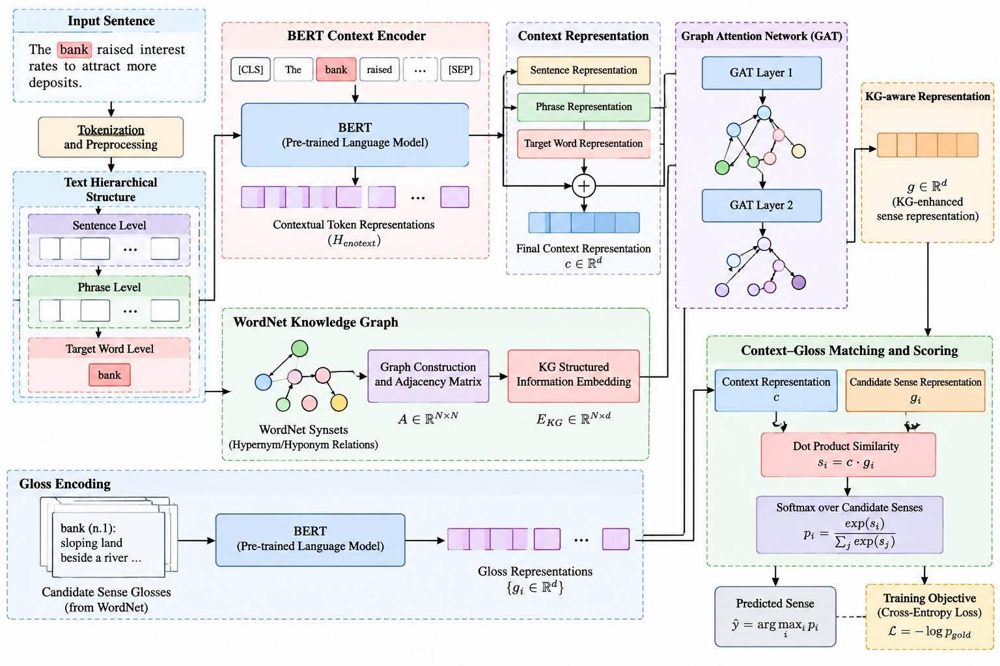
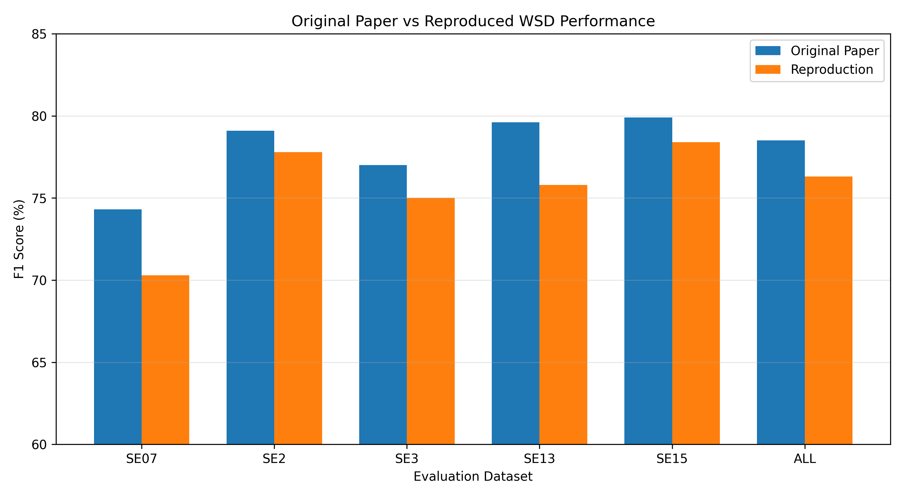
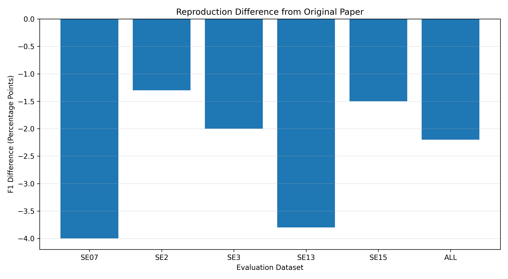
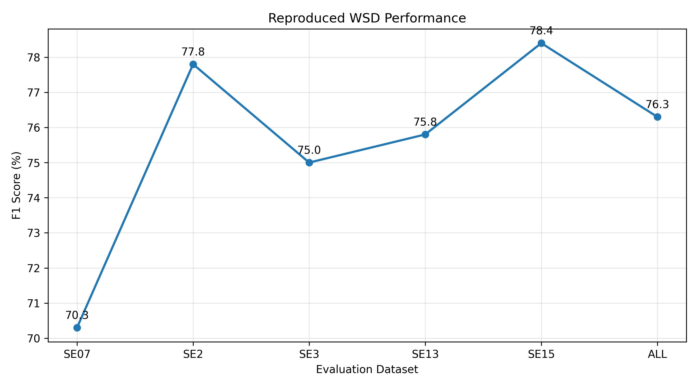
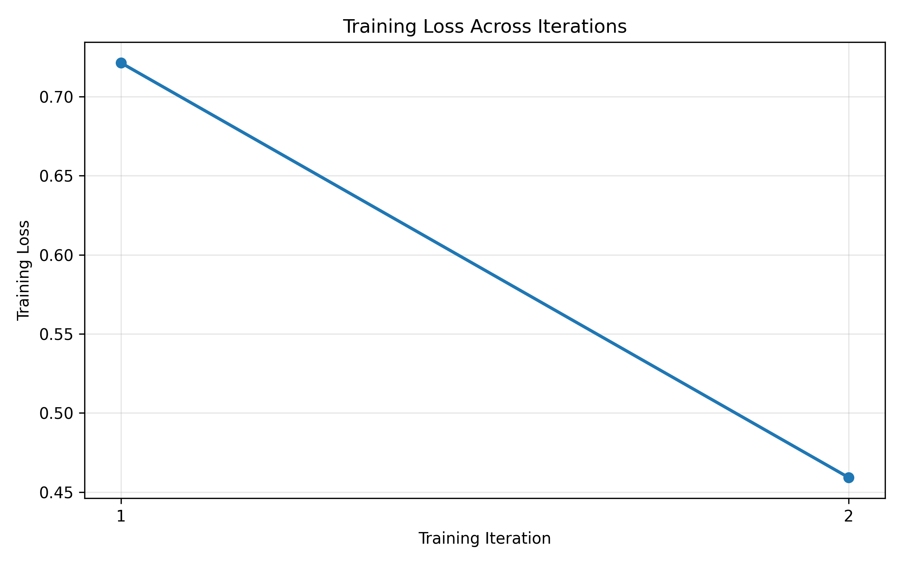
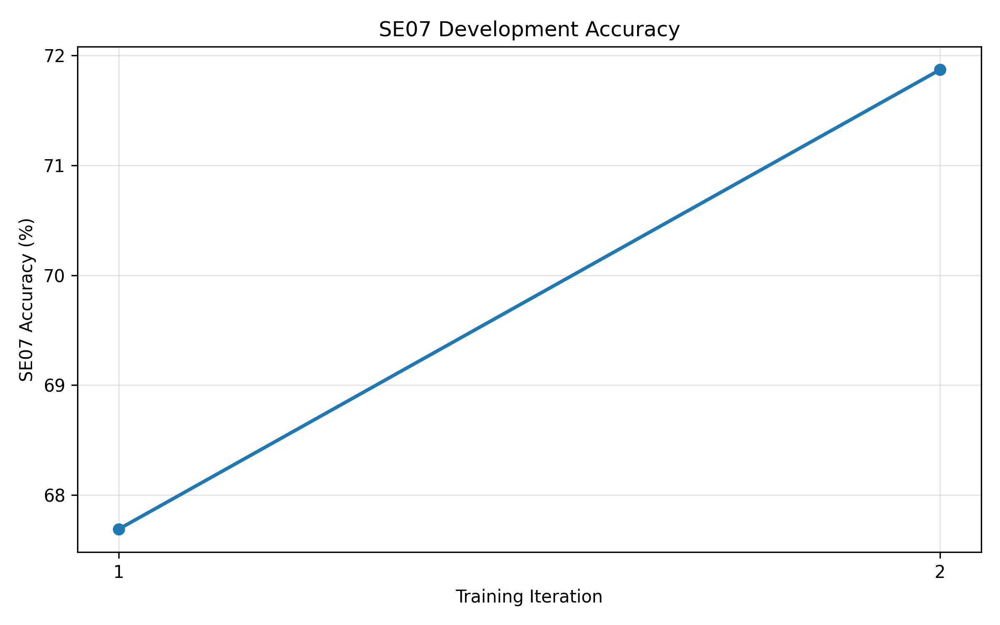
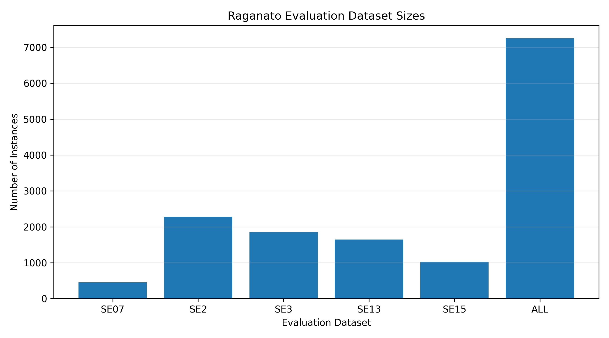

# Word Sense Disambiguation with a Knowledge Graph and Text Hierarchy


## What this repository contains

| File | Purpose |
|---|---|
| `WSD_Cao2024_V12_CODE_ONLY.ipynb` | The full pipeline: data extraction, model, training, benchmark inference and official scoring |
| `make_figures.py` | Regenerates the result figures below (matplotlib) |
| `graphs/` | The architecture diagram and the six result figures used in this README |
| `README.md` | This file |

The notebook is written to run on a Kaggle GPU session (Tesla T4).

## Method in brief

The model scores each candidate WordNet sense of a target word against its sentence context.



*Architecture overview. The sentence passes through the text hierarchy and a BERT context encoder, then a two-layer GAT, to give a context vector `c`. Each candidate gloss is encoded by a second BERT and combined with the WordNet knowledge-graph embedding to give a sense vector `g_i`. Senses are scored by dot product and trained with cross-entropy.*

1. **Context encoder (BERT)** encodes the sentence; the target word vector is taken from its word pieces.
2. **Text hierarchy** recursively splits the sentence where the two halves are least similar and pools the spans around the target.
3. **Graph attention (GAT)**, two layers over neighbouring words, refines the target representation.
4. **Gloss encoder (BERT)** encodes each candidate sense's WordNet definition.
5. **Knowledge-graph branch** builds a learnable embedding from WordNet hypernym and hyponym links (`Q = A · H · O + b`) and fuses it with the gloss vector.
6. **Score and loss:** dot product between context and sense vectors; cross-entropy over the candidate senses of the target word.

Both BERT encoders, the KG branch and the GAT are trained jointly.

## Concepts used in this work

Each row names a concept, says where it appears in this project or the paper, and gives a one-line explanation.

### Machine learning concepts

| Concept | Where it appears | In brief |
|---|---|---|
| Self-attention and multi-head attention | Both BERT encoders | Every token attends to every other token, and several attention heads capture different relations, producing a context-dependent vector per token |
| Positional encoding | BERT inputs | Position information is added to the token embeddings so word order matters (BERT learns these position embeddings instead of using fixed sinusoids) |
| Transformer encoder | Context and gloss encoders | BERT is the encoder half of the transformer. No decoder is needed because the task is to score a fixed set of candidate senses, not to generate text |
| Graph construction and representation learning | WordNet knowledge graph | Synsets are nodes and hypernym/hyponym links are edges; each synset gets a learnable embedding (117,659 x 128) |
| Supervised graph neural network training | Knowledge-graph branch, `Q = A · H · O + b` | Neighbour embeddings are aggregated with learned relation weights and projected by `O`; the graph part is trained end to end with the sense-classification loss |
| Graph convolution | Same branch | One-hop neighbourhood aggregation (`A · H`) is the core idea of GCN propagation; here it is a weighted mean over hypernyms and hyponyms |
| Graph attention networks (GAT) | Two-layer GAT on the context side | Attention coefficients let each word node weigh its neighbours by learned relevance, so useful context is kept and noisy context is down-weighted |
| Over-smoothing and scalability | GAT depth and KG implementation | A shallow 2-layer GAT limits over-smoothing; the 117k-node graph is stored as sparse neighbour lists rather than a dense N x N matrix |
| Two-tower (Siamese-style) architecture | Context tower and gloss tower | Two encoders map inputs into one space and are compared by similarity. Unlike a Siamese network the two BERTs do not share weights, and training uses softmax cross-entropy over candidates, not contrastive or triplet loss |
| Few-shot and zero-shot learning | Gloss-based sense matching | Because a sense is represented by its definition, rare senses can be scored with few or no training examples (related in spirit to few-shot learning) |
| Discriminative modelling | Whole model | The system is discriminative: it learns `p(sense | context)` directly |

### Natural language processing concepts

| Concept | Where it appears | In brief |
|---|---|---|
| NLP pipeline and levels of linguistic analysis | Whole project | Text goes through preprocessing, lexical lookup, semantic analysis and prediction. WSD is a semantic-level task within natural language understanding |
| Tokenization and lower casing | `bert-base-uncased` | WordPiece splits words into sub-word units; the uncased model lower-cases text first |
| Lemmatization | Candidate sense lookup | The tagged lemma, not the surface word, is used to fetch candidate synsets from WordNet (for example `said` maps to `say`) |
| Vector representations and cosine similarity | Hierarchy splitting and scoring | The text hierarchy splits where the two halves have the lowest cosine similarity; sense scores are dot products of L2-normalised vectors, i.e. cosine similarity scaled by a learned temperature |
| Annotated text corpora | SemCor, Raganato benchmark | SemCor is a sense-tagged corpus built on the Brown Corpus and read through NLTK; the SemEval/Senseval sets are the test data |
| Part-of-speech tagging | Candidate filtering | The POS tag of the target restricts candidates to senses of the right category (noun, verb, adjective, adverb) |
| Chunking and phrase structure | Text hierarchy | The hierarchy gives sentence, phrase and word levels, similar in spirit to chunking. It is built from vector similarity, not from a syntactic parser |
| Lexical relations: polysemy, synonymy, hypernymy, hyponymy | WordNet knowledge graph | Polysemy is the problem being solved; hypernym and hyponym relations are the graph edges |
| WordNet and its hierarchy | Glosses and graph | Each synset has a definition (gloss) and sits in an is-a hierarchy; both are used |
| Word sense disambiguation approaches | Whole model | This is a supervised, gloss-based approach that also uses knowledge-base structure: it compares the context with each candidate gloss and adds WordNet graph information |
| Contextual vs static word embeddings | BERT versus word2vec | Static embeddings such as word2vec give one vector per word. BERT gives a different vector for `bank` in each sentence, which is what makes sense disambiguation possible |
| Downstream applications | Motivation | WSD supports machine translation, question answering and information retrieval |

## Data

| Resource | Role | Size |
|---|---|---|
| WordNet 3.0 (via NLTK) | Glosses and knowledge graph | 117,659 synsets, 178,178 hypernym/hyponym edges |
| SemCor (via NLTK) | Training | 220,934 examples extracted (paper: 226,036) |
| SemEval-2007 (SE07) | Development | 455 instances |
| SE2, SE3, SE13, SE15 | Test | 2,282 / 1,850 / 1,644 / 1,022 |
| ALL | Combined test | 7,253 instances |

The Raganato *WSD Evaluation Framework* (datasets plus `Scorer.java`) is downloaded by the notebook.

## Requirements

- A CUDA GPU (developed on a Tesla T4, 14.6 GiB)
- Internet access in the session (WordNet/SemCor via NLTK, the evaluation framework, and the pretrained `bert-base-uncased` weights)
- Java (`javac` and `java`) for the official scorer
- Python packages pinned in the first notebook cell:
  `transformers==4.46.3`, `nltk==3.9.1`, `scikit-learn==1.5.2`, `tqdm==4.66.6`, plus PyTorch and pandas from the Kaggle image

## How to run

1. Upload `WSD_Cao2024_V12_CODE_ONLY.ipynb` to a Kaggle notebook.
2. In the session options, set **Accelerator: GPU T4** and turn **Internet: On**.
3. Run all cells. Expected early output: `Training examples: 220934`.
4. Outputs are written to `/kaggle/working/`:
   - `wsd_cao2024_final_best.pt`: selected checkpoint
   - `wsd_cao2024_results.csv`: official scorer results per dataset
   - `epoch_ckpts/`: one checkpoint per epoch

Training takes about 4.3 h per epoch on a T4, roughly 8.6 h for the default 2 epochs. A wall-clock guard stops starting new epochs after 10.25 h to stay inside Kaggle's 12 h limit.

## Configuration

Main settings are in the notebook's config cell:

| Setting | Default | Notes |
|---|---|---|
| `EPOCHS` | 2 | The paper allows up to 20 iterations, which cannot fit a 12 h session |
| `SEED` | 42 | |
| BERT learning rate | 1e-5 | |
| Head / KG-embedding learning rate | 1e-4 / 1e-3 | `PAPER_STRICT_LR = True` uses 1e-5 for everything, as in the paper |
| `INIT_PROJ_IDENTITY` | `True` | Projection layers start as identity so both towers share a space |
| `USE_GRAD_CKPT` | `True` | Gradient checkpointing; safe on a T4 |
| `MAX_LEN_CTX` / `MAX_CTX_WORDS` | 192 / 110 | Context is cropped around the target word |
| `SE07_TOLERANCE_POINTS` | 2.0 | Final model is the latest epoch within this many points of the best SE07 accuracy |

## Results

Official `Scorer.java` F1, reproduced against the paper:

| Dataset | Instances | Reproduced | Paper | Difference |
|---|---|---|---|---|
| SE07 (dev) | 455 | 70.3 | 74.3 | -4.0 |
| SE2 | 2,282 | 77.8 | 79.1 | -1.3 |
| SE3 | 1,850 | 75.0 | 77.0 | -2.0 |
| SE13 | 1,644 | 75.8 | 79.6 | -3.8 |
| SE15 | 1,022 | 78.4 | 79.9 | -1.5 |
| **ALL** | **7,253** | **76.3** | **78.5** | **-2.2** |

An earlier run of the same code scored 76.4 on ALL, so run-to-run variation is small. No frequency-prior post-processing is applied.

### Figures

**Reproduction against the paper**



The reproduction trails the paper on every dataset. The gap is smallest on SE2 (-1.3) and SE15 (-1.5) and largest on SE07 (-4.0) and SE13 (-3.8).





**Training behaviour (2 iterations)**

| Iteration | Training loss | SE07 dev accuracy |
|---|---|---|
| 1 | 0.721 | 67.7 |
| 2 | 0.459 | 71.9 |





SE07 development accuracy is the notebook's own per-epoch evaluation. It is a different measurement from the official scorer F1 on SE07 in the table above (70.3), so the two numbers are not expected to match.

**Evaluation data**



### Regenerating the figures

```bash
pip install matplotlib
python make_figures.py graphs     # writes PNGs to ./graphs
python make_figures.py my_dir     # or to any other folder
```

The numbers are listed at the top of `make_figures.py`; edit them after a new run.

## Implementation notes

An earlier version of this pipeline scored 72.0 on ALL. The fixes that closed most of that gap:

- **Dev gloss cache:** the SE07 gloss cache was built once from the untrained gloss encoder and reused every epoch; it is now rebuilt each epoch.
- **Candidate senses:** SemCor targets used the first lemma of the gold synset instead of the tagged lemma, giving wrong candidate sets for about 25% of examples. True multiword expressions (for example `took_place`) are now kept.
- **KG relation weights:** they were detached from the autograd graph and never learned; the KG branch is now vectorised and differentiable.
- **Truncation:** long sentences lost the target word at 96 word pieces; context is now cropped around the target.
- **Mixed precision:** a gradient scaler was added for fp16 training.

The fixes were applied together, so no ablation isolates the contribution of each one.

## Limitations

- Trained for 2 epochs rather than up to 20.
- 220,934 SemCor examples extracted versus 226,036 in the paper.
- No ablation of the KG, GAT and hierarchy components in this setup, so the cause of the remaining 2.2-point gap is not isolated.
- Exact replication of the paper is not claimed; the text hierarchy follows a similarity-based recursive split that may differ from the authors' exact procedure.

## Possible next steps

- Time a run without gradient checkpointing to afford more epochs.
- Ablate KG, GAT and hierarchy one at a time under the same setup.
- Add the WordNet Gloss Corpus as extra training data.

## Reference

Cao, Y., Jin, Z., Tang, Y., & Wei, B. (2024). *Word Sense Disambiguation with Knowledge Graph and Text Hierarchy*. ACM Transactions on Asian and Low-Resource Language Information Processing.

Evaluation framework: Raganato, A., Camacho-Collados, J., & Navigli, R. (2017). *Word Sense Disambiguation: A Unified Evaluation Framework and Empirical Comparison*. EACL.

## License

Add a license of your choice (for example MIT) before publishing.
